📈 InsightScore - Exam Performance Visualizer

Transforming raw academic data into actionable visual insights.

InsightScore is a comprehensive web platform designed to help students track their exam performance, visualize trends, and automatically identify weak topics for strategic improvement.

📜 Problem Statement

Students often face difficulty in understanding their performance trends across multiple exams. Although marks are available, they do not provide insights into which subjects or topics need more focus. Without visual analysis, students struggle to identify weak areas and create effective study plans.

There is a critical need for a tool that can collect past exam performance data and visually represent progress to enable better decision-making.

InsightScore addresses this by providing a centralized dashboard where students can log their exam results and topic-wise performance. The system uses data analytics to:

Visualize Progress: Interactive Line, Bar, and Pie charts show trends over time.
💡 The Solution

Pinpoint Weaknesses: Algorithms calculate error percentages to highlight specific weak topics.

Report Generation: Generates and emails PDF reports for offline review and planning.

🚀 Key Features & Deliverables

1. Data Entry & Management

Intuitive Input: Easy-to-use forms to enter Exam Name, Subject, Total Marks, Scored Marks, and granular Topic-wise error data.

Excel Database: Uses a persistent Excel-based database for user management, ensuring data portability and ease of access.

2. Advanced Visualization

Progress Trends: Line charts tracking performance percentages over time.

Subject Analysis: Bar charts comparing average scores across different subjects.

Error Distribution: Pie charts visualizing which topics contribute most to incorrect answers.

3. Intelligent Insights

Auto-Highlighting: Automatically flags the top 5 weakest topics based on error rate percentage.

Accuracy Breakdown: Detailed tables showing Total Questions vs. Incorrect Answers for every topic.

4. User Features

Authentication: Secure Login, Registration, and OTP-based Password Recovery (Mock/Email integration).

Profile Management: Profile picture upload and user details.

PDF Reports: One-click generation of performance summaries sent directly to the user's email.

🛠️ Technology Stack

Frontend:

HTML5 & CSS3 (Custom responsive layout)

Tailwind CSS (Modern utility-first styling)

JavaScript (Vanilla) (DOM manipulation and logic)

Chart.js (Interactive data visualization)

Lucide Icons (Clean, consistent iconography)

Backend:

Python (Flask) (Server-side logic and API handling)

Pandas (Data manipulation and Excel database management)

FPDF (PDF Report generation)

Flask-Mail (SMTP Email services)

📂 Project Structure

InsightScore/
├── app.py                 # Main Flask application entry point
├── users.xlsx             # User database (Auto-generated)
├── exams_data.json        # Exam records storage (Auto-generated)
├── static/
│   ├── style.css          # Custom styles and animations
│   ├── script.js          # Frontend logic, Chart.js config, API calls
│   ├── auth.js            # Authentication handling logic
│   └── uploads/           # User profile pictures
└── templates/
    ├── index.html         # Main Dashboard UI
    └── login.html         # Login/Register/Forgot Password UI

⚙️ Installation & Setup

Follow these steps to run the project locally.

Prerequisites

Python 3.8 or higher installed.

1. Clone the Repository

git clone [https://github.com/your-username/InsightScore.git](https://github.com/your-username/InsightScore.git)
cd InsightScore

2. Install Dependencies

pip install flask pandas openpyxl fpdf flask-mail

3. Configure Email (Optional)

To enable the "Email PDF Report" feature, open app.py and update the email configuration:

app.config['MAIL_USERNAME'] = 'your-email@gmail.com'
app.config['MAIL_PASSWORD'] = 'your-app-password' # Generate via Google Account > Security > App Passwords

4. Run the Application

python app.py

### SCREENSHOTS:

#### LOGIN PAGE->
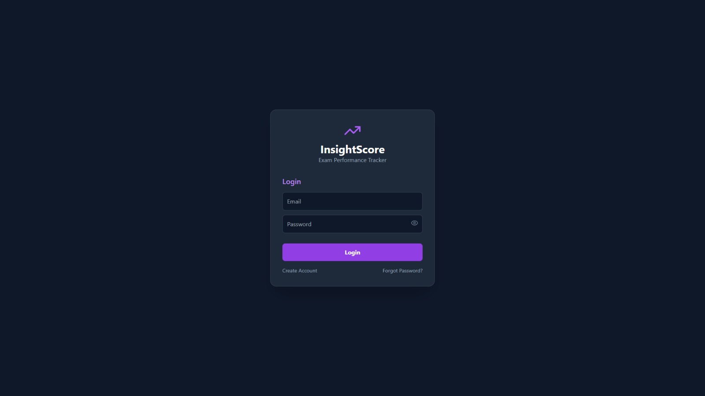
#### REGISTRATION PAGE->
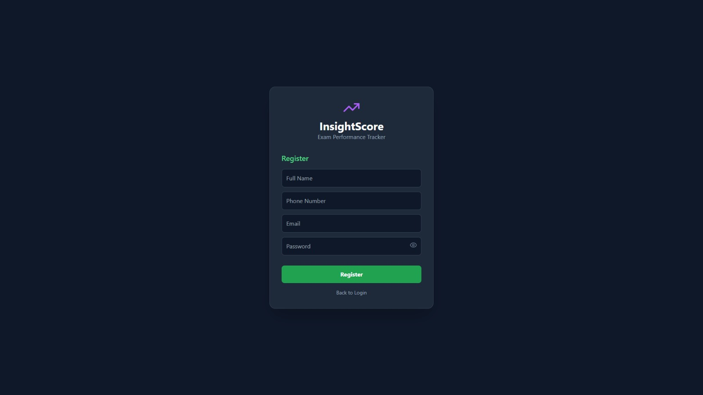
##### RESET PASSWORD/DIRECT LOGIN PAGE->
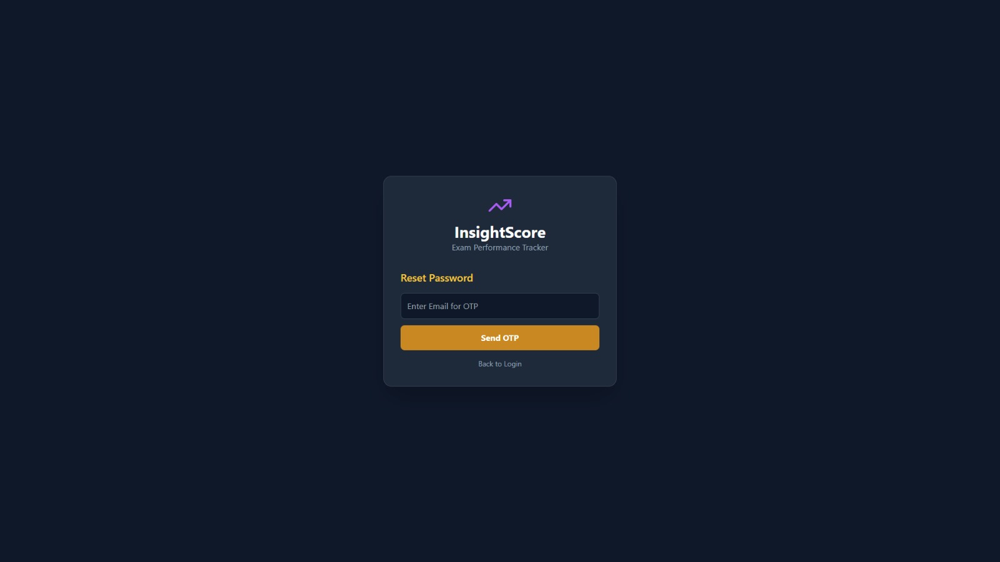
###### OTP VERIFICATION PAGE->
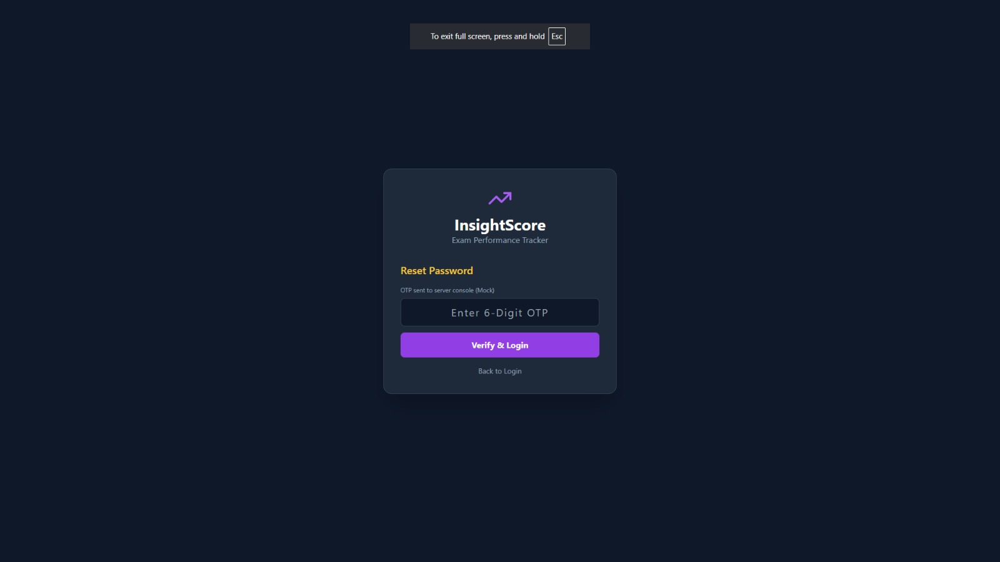
####### DASHBOARD SHOWING OVERALL PERFORMANCE->
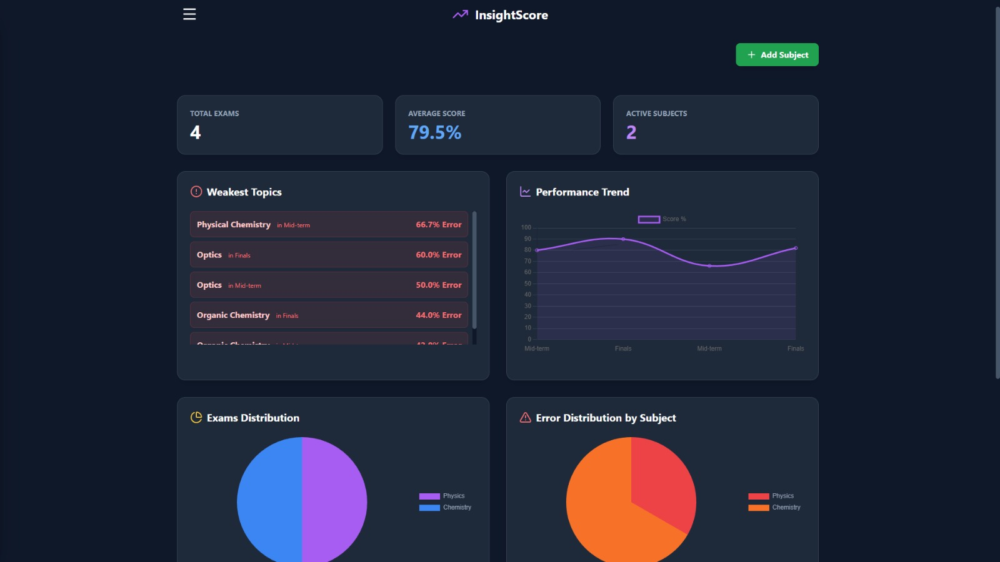
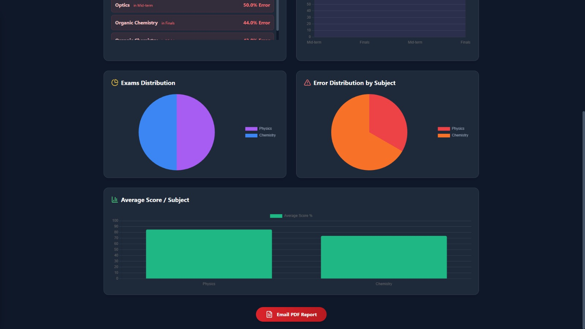
######## CONTENT NAVIGATION SIDE BAR->
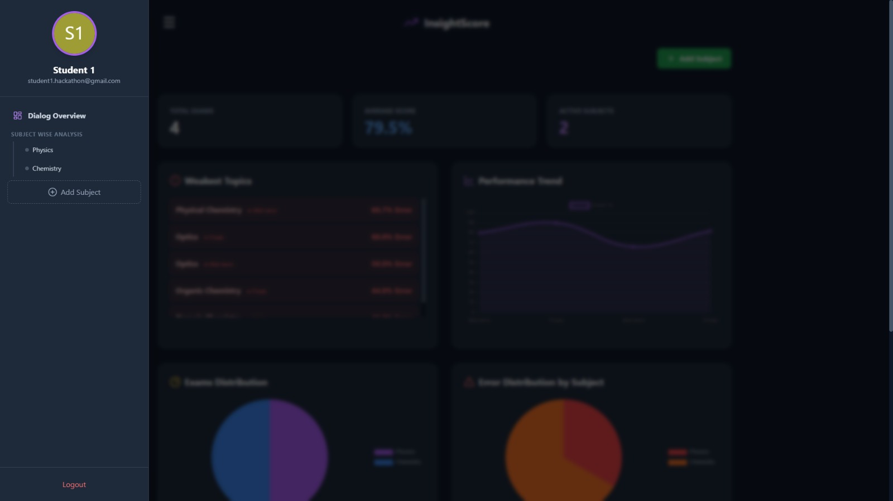
######### INDIVIDUAL SUBJECT ANALYSIS PAGE->
##### SUBJECT 1 (PHYSICS)->
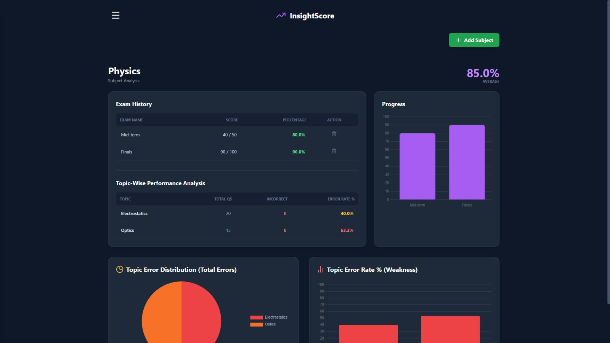
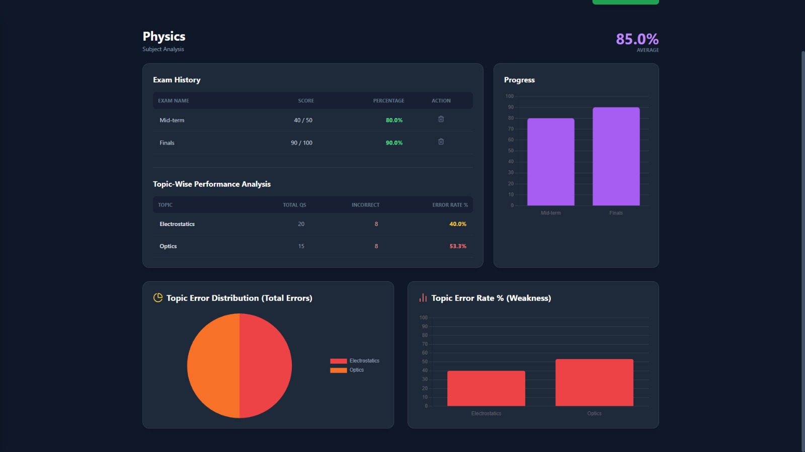
##### SUBJECT 2 (CHEMISTRY)->
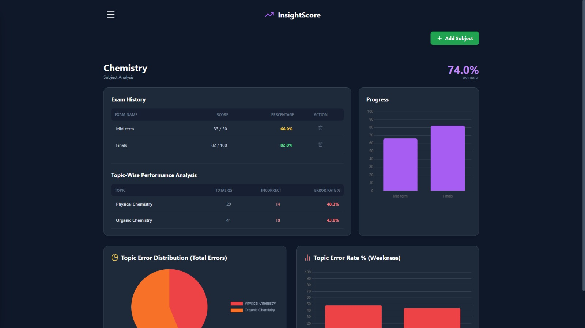
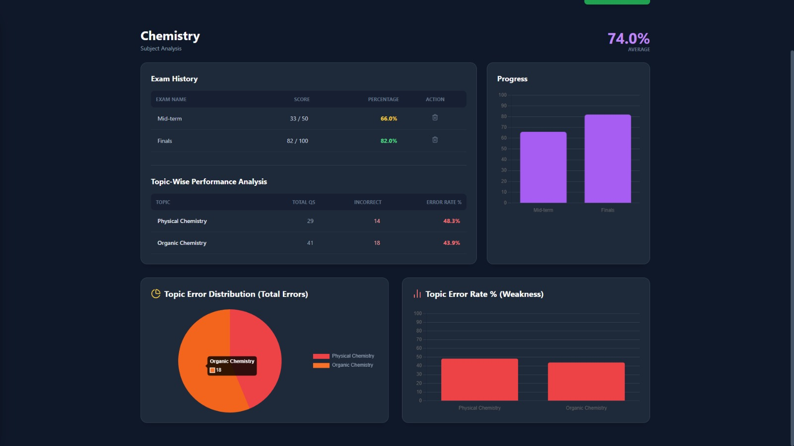
